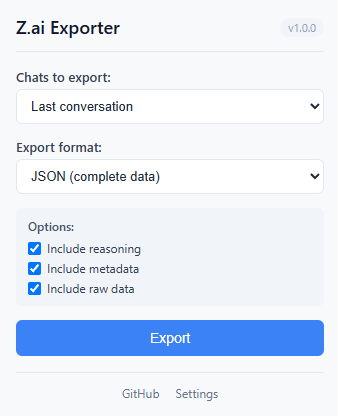
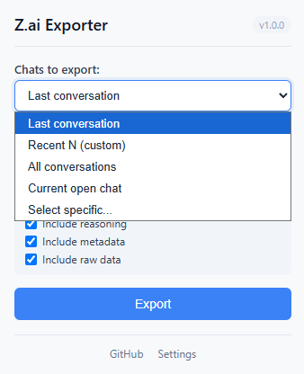
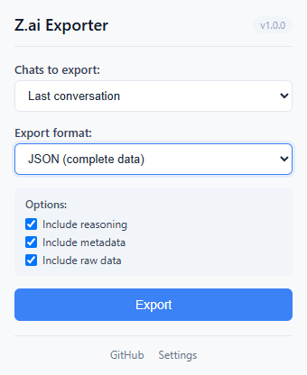
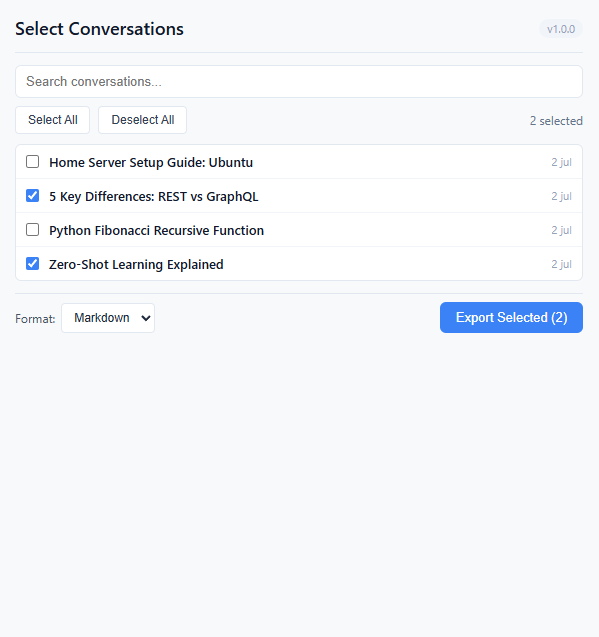
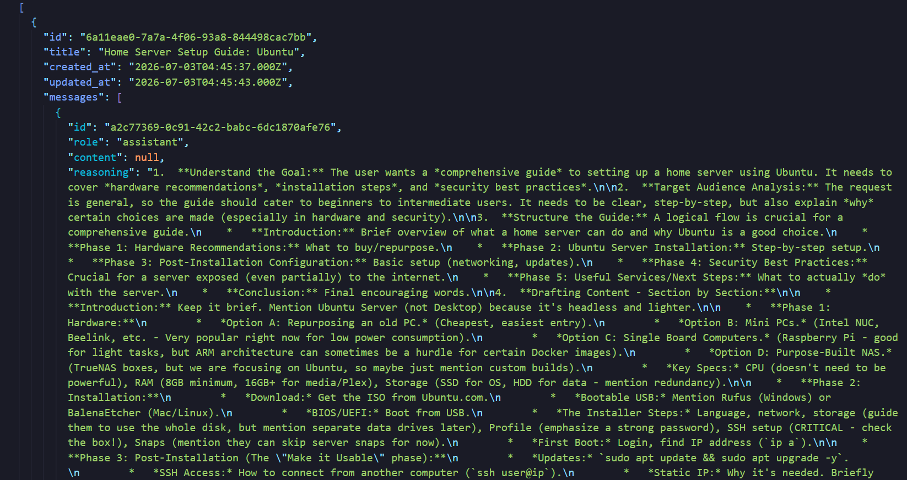
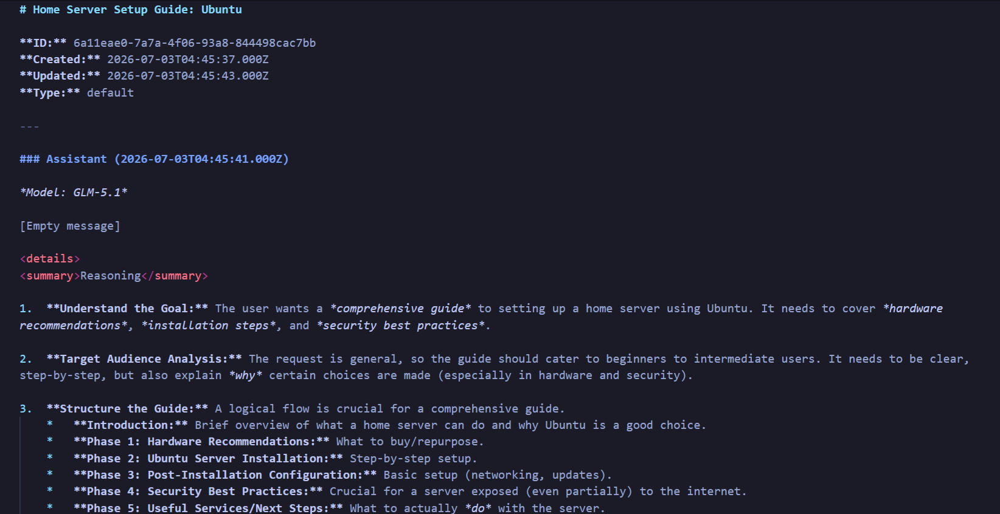

<p align="center">
  
</p>

# Z.ai Chat Exporter

[](https://addons.mozilla.org/...)
[](https://microsoftedge.microsoft.com/...)
[](LICENSE)
[](https://github.com/carlonox/zai-chat-exporter/stargazers)

> Export your Z.ai conversations to JSON, Markdown, or plain text. Preserves reasoning, metadata, and message structure.

---

## Why I built this

I've been using Z.ai (formerly GLM) since its early days — it's a powerful platform, but there was no way to export conversations. I needed a reliable backup of my research discussions. After reverse-engineering the API (it's surprisingly clean — hats off to the Z.ai team), I realized the data model was straightforward enough to build an exporter in a weekend. What started as a personal script turned into this extension.

If you're reading this: yes, I spent way too much time making the popup look good.

---

## Features

- Export **one, multiple, or all** conversations
- Choose from **3 formats**: JSON (complete), Markdown (readable), Plain Text (simple)
- Preserves **model reasoning** (thinking process)
- Includes **metadata**: timestamps, token usage, model names
- Works with **all Z.ai agents** (including GLM-5, GLM-4, etc.)
- Lightweight and privacy-focused — all data stays in your browser

---

## Screenshots

### Popup (main menu)


### Popup — chat selection dropdown


### Popup — format selection dropdown


### Conversation selection window (with search & checkboxes)


### Export result — JSON (full data)


### Export result — Markdown (readable)


---

## Installation

### From the store (recommended)

- **Firefox**: [Download from Firefox Add-ons](https://addons.mozilla.org/...)
- **Edge**: [Download from Edge Add-ons](https://microsoftedge.microsoft.com/...)

### Manual installation (development)

1. Clone this repository:
   ```bash
   git clone https://github.com/carlonox/zai-chat-exporter.git
   cd zai-chat-exporter
   ```

2. **For Firefox**: load the `src/` folder as a temporary add-on:
   - Open `about:debugging`
   - Click "This Firefox" → "Load Temporary Add-on"
   - Select `src/manifest.firefox.json`

3. **For Edge/Chrome**: load the unpacked extension:
   - Open `chrome://extensions/` or `edge://extensions/`
   - Enable "Developer mode"
   - Click "Load unpacked"
   - Select the `src/` folder

---

## How it works

The extension uses Z.ai API:

1. `GET /chats/?page=1&type=default` → list of conversations
2. `GET /chats/{id}` → metadata + message IDs
3. `POST /chats/{id}/messages/batch` → complete message content

All requests are authenticated using your Z.ai session token (stored in `localStorage`).

---

## Export formats

| Format | Best for | Includes |
|--------|----------|----------|
| **JSON** | Data backup, migration, analysis | Everything (messages, reasoning, metadata, token usage, raw data) |
| **Markdown** | Reading, sharing, documentation | Clean formatting with collapsible reasoning sections |
| **Plain Text** | Quick copy-paste, universal | Raw messages without formatting |

---

## Privacy & Security

- **No data is sent to any server** — all processing happens locally in your browser
- The extension only reads your conversations; it cannot modify or delete them
- Your authentication token is never transmitted outside of your browser

---

## Development

### Project structure

```
zai-chat-exporter/
├─── src/
│   ├─── manifest.firefox.json
│   ├─── manifest.edge.json
│   ├─── popup/
│   │   ├─── popup.html
│   │   ├─── popup.js
│   │   └─── popup.css
│   ├─── background/
│   │   └─── background.js
│   ├─── content/
│   │   ├─── content.js
│   │   └─── content.css
│   └─── lib/
│       ├─── api.js
│       ├─── exporters.js
│       └─── utils.js
├─── docs/
│   ├─── screenshots/
│   └─── architecture.md
├─── README.md
├─── LICENSE
├─── CHANGELOG.md
└─── CONTRIBUTING.md
```

### Running locally

1. Make changes to the code in `src/`
2. Reload the extension from the browser extension manager
3. Test on [chat.z.ai](https://chat.z.ai)

---

## Contributing

Contributions are welcome! Please read our [Contributing Guidelines](CONTRIBUTING.md).

---

## License

This project is licensed under the MIT License -- see the [LICENSE](LICENSE) file.

---

## Support

- **Issues**: [GitHub Issues](https://github.com/carlonox/zai-chat-exporter/issues)
- **Email**: [cjcuervob@gmail.com](mailto:cjcuervob@gmail.com)

---

## Author

**Carlos Javier Cuervo Baracaldo**
- [GitHub](https://github.com/carlonox)
- [LinkedIn](https://www.linkedin.com/in/carlos-javier-cuervo-baracaldo-113ab3283/)

---

> Built with heart for the Z.ai community. Found a bug? Want a feature? [Open an issue](https://github.com/carlonox/zai-chat-exporter/issues) -- I read every one.

If the extension helps you, drop a star -- it helps others discover it too.
